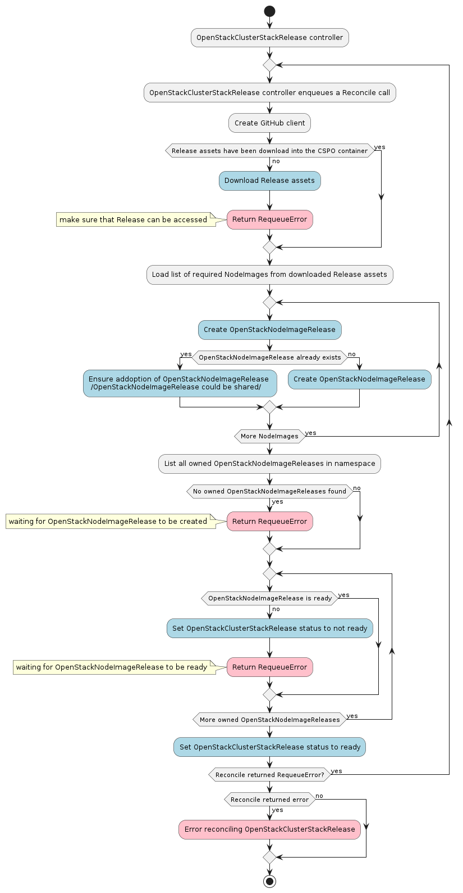
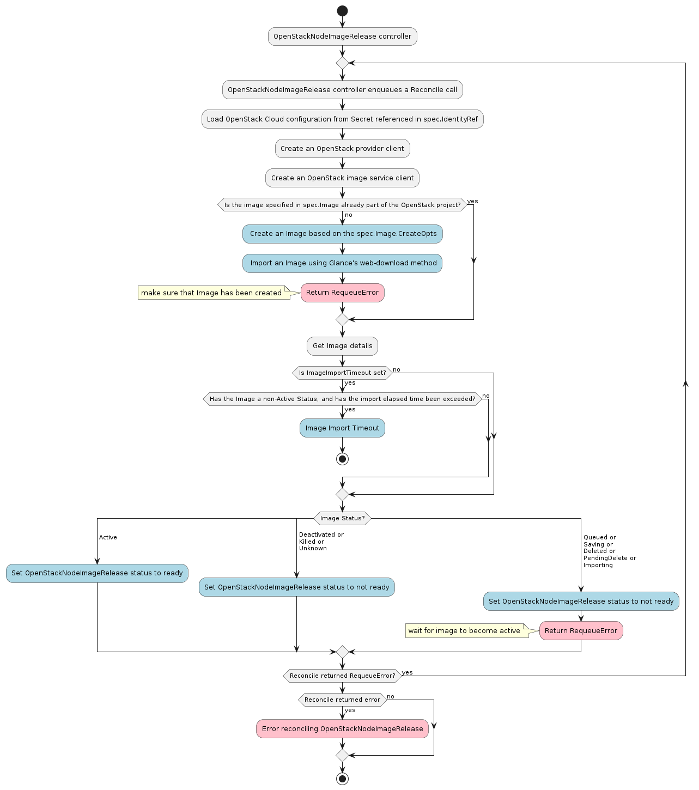

# Controllers

## OpenStackClusterStackRelease controller

The OpenStackClusterStackRelease controller’s main responsibilities are:

- Download release assets into the CSPO container
- Create OpenStackNodeImageRelease resources based on the required NodeImages defined in the downloaded release asset `node-images.yaml`
- Set an OwnerReference on the existing OpenStackNodeImageRelease resources that could be utilized by the ClusterStack release (multiple versions of one ClusterStack could share an image)
- Update the OpenStackClusterStackRelease status to `ready` once all related OpenStackNodeImageReleases are also `ready`

## OpenStackNodeImageRelease controller

The OpenStackNodeImageRelease controller’s main responsibilities are:

- Load the OpenStack Cloud configuration from the Secret referenced in `spec.IdentityRef`
- Create an Image as defined by `spec.Image` if it does not already exist in the specified OpenStack project
- Instruct the OpenStack Glance service to import an Image from the provided URL
- Set the OpenStackNodeImageRelease status to `ready` once the image achieves an Active status

