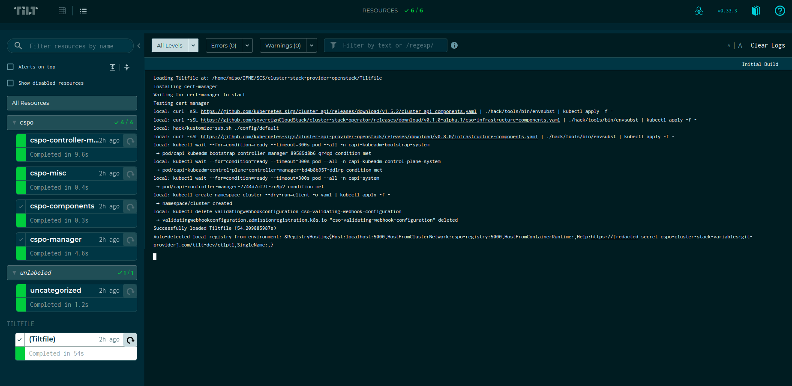

# Developer Guide

Developing Cluster Stack Provider OpenStack operator is quite straightforward. First, you need to install some basic prerequisites:

- Docker
- Go

Next, configure your environment variables. Once that's done, you can initiate development using the local Kind cluster and the Tilt UI to create a workload cluster that comes pre-configured.

## Setting Tilt up

1. Install Docker and Go. We expect you to run on a Linux OS.
2. Create an `.envrc` file and specify the values you need. See the `.envrc.sample` for details.

## Developing with Tilt



Operator development requires a lot of iteration, and the “build, tag, push, update deployment” workflow can be very tedious. Tilt makes this process much simpler by watching for updates and automatically building and deploying them. To build a kind cluster and to start Tilt, run:

```shell
make tilt-up
```

> To access the Tilt UI please go to: `http://localhost:10351`

You should make sure that everything in the UI looks green. If not, you can trigger the Tilt workflow again.

### Applying ClusterStack

When you start your tilt setup then the ClusterStack manifest gets copied from `config/cspo` directory to root of your repository. In order to apply the ClusterStack to the running local development cluster, you can click on the tilt UI. There should a click on the top-right hand side that is named as `apply-clusterstack` if you hover over it. 
Once the ClusterStack is applied wait for the ClusterStack and ClusterStackRelease object to be ready. In case your ClusterStack shows that it is ready, you can deploy a workload cluster. 

### Creating workload cluster

This could be done through the Tilt UI, by pressing the button in the top right corner `Create Workload Cluster`. This triggers the `make create-workload-cluster-openstack`, which uses the environment variables and the cluster-template.

To interact with your freshly created workload cluster, you can use these commands:

```shell
make get-kubeconfig-workload-cluster #KUBECONFIG for the workload cluster is placed here: ".workload-cluster-kubeconfig.yaml"
export KUBECONFIG=$PWD/.workload-cluster-kubeconfig.yaml
```

In case you want to change some code, you can do so and see that Tilt triggers on save. It will update the container of the operator automatically.

If you want to change something in your ClusterStack or Cluster custom resources, you can have a look at `.cluster.yaml` and `.clusterstack.yaml`, which Tilt uses.

To delete the ClusterStack you can click on the `delete-clusterstack` button in the tilt UI.

To tear down the workload cluster, click on the `Delete Workload Cluster` button in the top right corner of the Tilt UI. This action triggers the execution of `make delete-workload-cluster-openstack`. After a few minutes, the resources should be successfully deleted.

To tear down the kind cluster, use:

```shell
make delete-bootstrap-cluster
```

If you have any trouble finding the right command, then you can use `make help` to get a list of all available make targets.

## Toggle between local_mode and remote mode

We can retrieve cluster-stacks in two modes. One way is to let the controller fetch it from GitHub which is remote mode and other is we mount the cluster-stacks inside the container at `/tmp/downloads/cluster-stacks` directory.

> [!NOTE]  
> Using remote mode is the default behavior.

Switching between both modes is relatively simple if you're using Tilt. There is a file at the root of the repo `tilt-settings.yaml.example`
Make a copy of that file with the name of `tilt-settings.yaml`

```bash
cp tilt-settings.yaml.example tilt-settings.yaml
```

Now, open the file and set the `local_mode` to `true` to use cluster-stacks in local_mode. It should look the following content wise.

```yaml
local_mode: true
```

> [!NOTE]
> In this mode you need to have cluster-stacks present locally.

Downloading cluster-stacks can be achieved by many ways but below is a simple way to download it quickly.

```bash
mkdir -p .release/openstack-scs-1-27-v1/
cd .release/openstack-scs-1-27-v1
gh release download --repo sovereigncloudstack/cluster-stacks openstack-scs-1-27-v1
```

Change the repo and tag as per the requirement. You can also download it directly from browser and move it to `.release` directory.

Please make sure the directory structure remains the same otherwise you'll not be able to start the tilt setup. Here's an example of structuring `openstack-scs-1-27-v1` cluster-stack.

```bash
$ tree .release/openstack-scs-1-27-v1/
.release/openstack-scs-1-27-v1/
├── clusterstack.yaml
├── metadata.yaml
└── openstack-scs-1-27-cluster-class-v1.tgz
```

> [!IMPORTANT]
There's an alternative way to get clusterstacks using [csmctl](https://github.com/sovereigncloudstack/csmctl). You can follow the README of csmctl for specific instructions and a good quickstart.

You can use `csmctl create` subcommand to create clusterstack locally. You'll need a csmctl.yaml file in the cluster-stack configuration directory. Please read more about creating configuration file for csmctl in the csmctl docs. 
