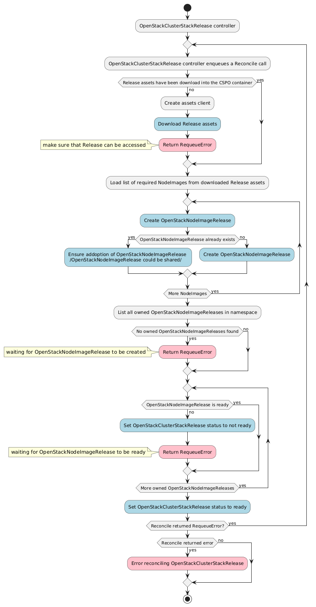

# OpenStackClusterStackRelease controller

The OpenStackClusterStackRelease controller’s main responsibilities are:

- Download release assets into the CSPO container
- Create OpenStackNodeImageRelease resources based on the required NodeImages defined in the downloaded release asset `node-images.yaml`
- Set an OwnerReference on the existing OpenStackNodeImageRelease resources that could be utilized by the ClusterStack release (multiple versions of one ClusterStack could share an image)
- Update the OpenStackClusterStackRelease status to `ready` once all related OpenStackNodeImageReleases are also `ready`

