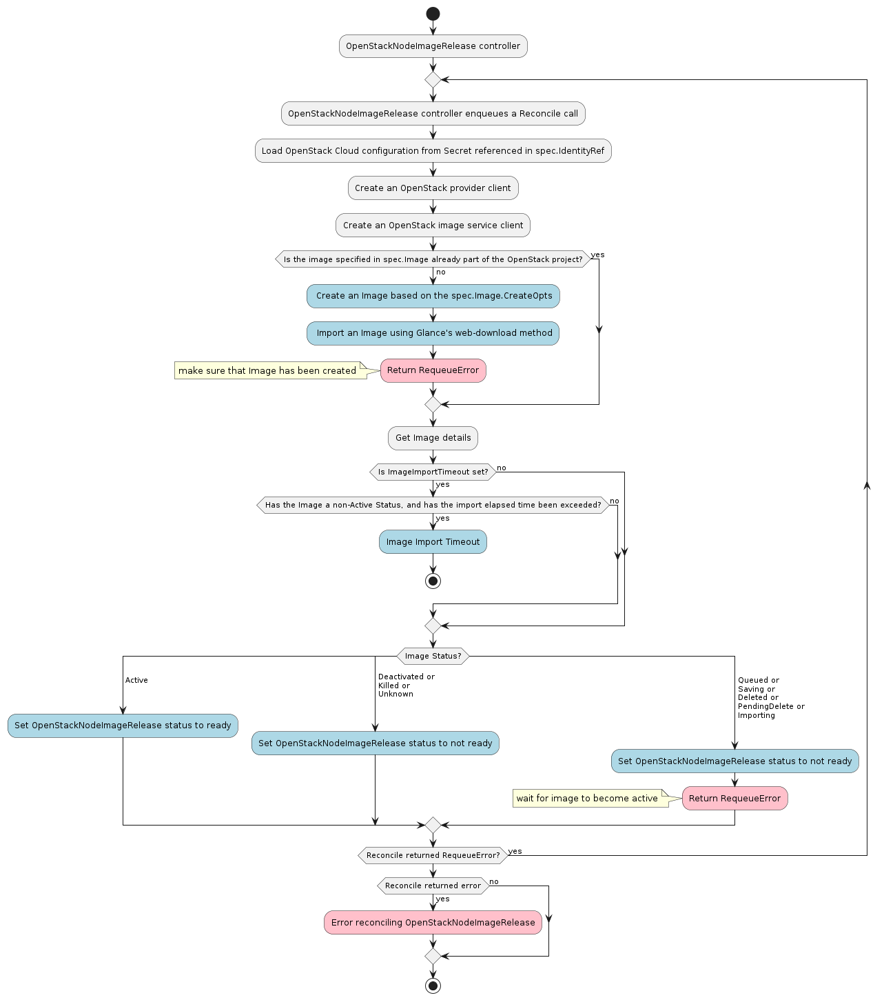

# OpenStackNodeImageRelease controller

The OpenStackNodeImageRelease controller’s main responsibilities are:
- Load the OpenStack Cloud configuration from the Secret referenced in `spec.IdentityRef`
- Create an Image as defined by `spec.Image` if it does not already exist in the specified OpenStack project
- Instruct the OpenStack Glance service to import an Image from the provided URL
- Set the OpenStackNodeImageRelease status to `ready` once the image achieves an Active status

